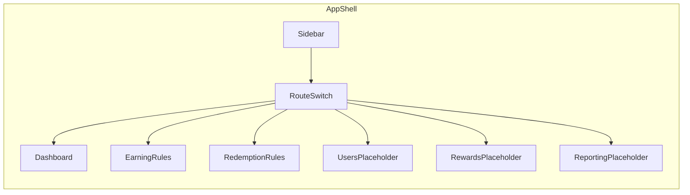
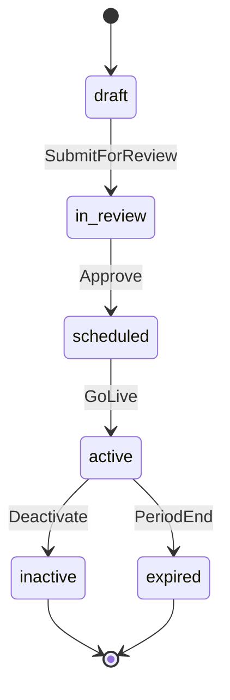

# BNI Loyalty — Back Office Portal

Feature reference for the `banking-loyalty-back-office` prototype. Use this document to track module scope, user flows, data shapes, and implementation status as the app evolves.

## Overview

**Purpose:** Front-end prototype for a banking loyalty program back-office portal. Targets operations, product, finance, and approval teams who manage loyalty points (earning/redemption rules), monitor KPIs, and eventually run reports.

**Branding:** BNI Loyalty — Back Office Portal

**Stack:**

| Layer | Technology |
|-------|------------|
| Framework | React 19 |
| Language | TypeScript 5.8 (strict) |
| Build | Vite 7 |
| Styling | Tailwind CSS 3.4 + custom design tokens |
| Charts | Recharts 2.15 |
| Icons | Lucide React |

**Architecture:** For system architecture, domain model, phased backend plan, and prototype gap analysis, see [ARCHITECTURE.md](ARCHITECTURE.md).

**Last updated:** 2026-06-25 11:55 WIB (`f804673`)

**Prototype constraints:**

- Mock data only — no backend, API, or persistence
- No authentication — role toggle is UI-only
- No URL routing — navigation via `useState<RouteKey>` in `src/App.tsx`
- All pages live in a single `App.tsx` file; types in `src/types.ts`, data in `src/data/mockData.ts`

---

## Feature Tracking Summary

High-level status vs [ARCHITECTURE.md](ARCHITECTURE.md) build phases. **UI** = prototype screen exists; **Data** = mock/static only; **Backend** = not started.

| Module | Arch. phase | UI | Data | Backend | Blockers / notes |
|--------|-------------|----|------|---------|------------------|
| Earning Rule — Tab General (`PointConfig`) | 1 | — | — | — | Gap #7: shared vs duplicated record TBD |
| Earning Rule — Rule tab | 1 | Done | Mock | — | Date range picker for period; submit/approve/toggle non-functional |
| Redemption Rule | 1 | Done | Mock | — | Shared `RuleModule`; Gap #4 on `ruleTabId`/`sourceTypeId` |
| Analytics Dashboard | 3 | Done | Mock | — | KPI formulas open — [§9 gaps #8–15](ARCHITECTURE.md#9-gaps--open-questions-to-resolve-before-build) |
| Reporting | 4 | Tabs only | — | — | Six tabs shell; no report tables |
| User | — | Shell | — | — | Out of scope in ARCHITECTURE.md |
| Rewards Points Management | — | Shell | — | — | Out of scope; needed before Phase 2 eval engine |

**Phase 1 frontend checklist** (from [ARCHITECTURE.md §10](ARCHITECTURE.md#phase-1-scope-card-implementation-checklist)): Tab General UI, unified `Rule` type, wire workflow actions — all pending.

---

## Navigation Map

| Route Key | Label | Description | Status |
|-----------|-------|-------------|--------|
| `dashboard` | Analytics Dashboard | Monitoring KPI loyalty, campaign, liability, dan channel | **Implemented** (mock; Phase 3 backend) |
| `earning-rules` | Earning Rule | Konfigurasi aturan perolehan poin | **Partial** — Rule tab only; Tab General not started |
| `redemption-rules` | Redemption Rule | Konfigurasi aturan penukaran poin | **Implemented** (mock; Phase 1 backend) |
| `users` | User | Daftar dan profil pengguna loyalty | Placeholder |
| `rewards` | Rewards Points Management | Katalog reward dan stok | Placeholder |
| `reporting` | Reporting | Laporan operasional dan rekonsiliasi | Placeholder (tabs only; Phase 4) |

**Shell layout:**



**Header breadcrumb:** `Portal / {activeItem.label}`

**Source files:** `src/types.ts` (`RouteKey`), `src/data/mockData.ts` (`navItems`), `src/App.tsx` (routing)

---

## 1. Analytics Dashboard

**Route:** `dashboard`  
**Architecture:** [ARCHITECTURE.md §6](ARCHITECTURE.md#6-module-analytics-dashboard) · **Build phase:** 3 (data mart + live queries)

### Purpose

Monitor loyalty KPIs across customer engagement, point performance, transaction impact, channel performance, and campaigns. Surfaces open business-definition gaps via an audit panel. Production KPI definitions and data sources are specified in ARCHITECTURE.md §6.1; prototype uses static `dashboardData` only.

### Key UI Elements

**Filters** (`DashboardFilters`):

| Filter | Options | Notes |
|--------|---------|-------|
| Start / End date | Date inputs | Default from `defaultFilters` in mockData |
| Channel | All, Wondr, ATM, API, BNI Direct, Mbank, SMS | |
| Source system | All, Saving, Cardlink | |
| Transaction type | Purchase, Payment, transfers, VA | **Disabled** unless source = Saving |
| Campaign | Campaign selector | Used in before/after chart |

**KPI card groups** (from `dashboardData`):

1. **Customer Engagement** — CIF Earning MTD, CIF Redeem MTD, Redemption Rate by CIF, Redemption Rate by Poin
2. **Poin Performance** — Total Poin Issued/Redeemed YTD, Poin Balance Liability, Expired Points YTD, Estimated Point Cost (placeholder)
3. **Transaction Impact** — Top Aktivitas, Top Source
4. **Channel Performance** — Top Redeem Channel, Top Earn Channel, Top Reward
5. **Campaign** — Campaign Aktif, Participation Rate, Top Campaign

Each KPI card shows value, detail, delta, and trend (`up` | `down` | `flat`). "View details" links are present but non-functional.

**Charts:**

| Chart | Type | Data source |
|-------|------|-------------|
| Daily / Weekly / Monthly trend | Line | `trends` — CIF earn/redeem, point earn/redeem (millions) |
| Earning poin per aktivitas | Bar | `earningByActivity` |
| Earning poin per source | Donut | `earningBySource` (Saving vs Cardlink) |
| Redemption per channel | Area | `redemptionByChannel` |
| Redemption per reward | Donut | `redemptionByReward` |
| Before vs after campaign | Bar | Derived from selected `CampaignSummary` |

**Other UI:**

- Export PDF / Export PNG buttons (non-functional)
- Dashboard audit panel — 8 business sign-off notes (see [Open Items](#open-items--business-sign-off))
- "Last updated: just now" — no real-time polling

### User Flow

1. App loads with `dashboard` as default route
2. User reviews KPI cards and charts
3. User adjusts filters (dates, channel, source, transaction type)
4. If source ≠ Saving, transaction type resets to "all" and the field disables
5. Trend line chart scales by `filterFactor`; other KPIs and charts remain static
6. User selects a campaign in the before/after comparison chart
7. User scrolls to audit panel to review open business questions
8. Optional: Export PDF/PNG or "View details" (no action)

### State & Data

| State | Type | Location |
|-------|------|----------|
| `filters` | `DashboardFilters` | `Dashboard` component |

**Filter simulation:** Only the trend chart responds to filters via a multiplier:

```
filterFactor = channelFactor × sourceFactor × transactionFactor
```

KPI cards and distribution charts always show full mock data.

### Status

| Capability | Status |
|------------|--------|
| KPI cards | Done (mock) |
| Charts | Done (mock) |
| Filters | Partial — trend only |
| Export | Non-functional |
| Drill-down | Non-functional |
| Real-time SLA | Undefined |

---

## 2. Earning Rule Management

**Route:** `earning-rules`  
**Architecture:** [ARCHITECTURE.md §4](ARCHITECTURE.md#4-module-earning-rule--redemption-rule-engine) · **Build phase:** 1

### Purpose

Configure and review point-earning rules. Supports role-based editing and a full add/edit drawer with conditional fields per rule type.

**Tab structure (requirements vs prototype):** The architecture spec defines two tabs — **General** (`PointConfig`: point logo, name, expiry/reset policy) and **Rule** (rule list/CRUD). Only the **Rule** tab is implemented in the prototype today. Tab General is not started — see [ARCHITECTURE.md §4.1](ARCHITECTURE.md#41-tab-structure) and [§12 Prototype Alignment Matrix](ARCHITECTURE.md#12-prototype-alignment-matrix).

### Key UI Elements

- **Role toggle:** `employee` | `approver` (UI-only, no auth)
- **Summary counters:** Total rules + count per status (draft, in_review, scheduled, active, inactive, expired)
- **Search:** By rule name, code, or ID
- **Status filter:** All or specific `RuleStatus`
- **Data table columns:** No, Rule (name + code), Period, Type, Status, Created time, Total CIF, Total point, Actions
- **Actions:** Edit (role/status gated), Inactive (active rules only; non-functional)
- **Add rule drawer:** Side panel with conditional fields
- **Export:** CSV / XLSX buttons (non-functional)

**Mock data:** 6 earning rules in `rules` (filtered by `ruleMode: "EARN"`) covering all rule types and statuses.

### User Flows

#### Employee flow

1. Sidebar → **Earning Rule**
2. Role defaults to **employee**
3. View summary counters and rule table
4. Search and/or filter by status
5. **Edit** visible only on **draft** rules
6. Click **Add rule** → drawer opens with default type `transactional`
7. Select rule type → conditional fields appear
8. Review point calculation example
9. **Submit for review** or **Cancel** (no persistence)

#### Approver flow

1. Toggle role to **approver**
2. **Edit** available for `in_review` and `scheduled` rules
3. Same search, filter, and add flow as employee

### Permissions

```typescript
// src/domain/ruleStatus.ts — canEdit()
employee  → edit draft only
approver  → edit in_review, scheduled
```

### State & Data

| State | Type | Purpose |
|-------|------|---------|
| `role` | `Role` | Edit permissions |
| `query` | `string` | Search filter |
| `status` | `RuleStatus \| "all"` | Status filter |
| `drawerOpen` | `boolean` | Drawer visibility |
| `drawerMode` | `"add" \| "edit"` | Drawer mode |
| `drawerRule` | `Rule \| null` | Rule being edited |
| `selectedType` | `RuleType` | Active rule type in drawer |
| `periodStart` / `periodEnd` | `string` | Rule period in drawer (`DateRangeField`; synced on open) |

**Data:** `getRulesByMode("EARN")` from unified `rules` in `src/data/mockData.ts`, type `Rule` from `src/domain/rule.ts`

### Status

| Capability | Status |
|------------|--------|
| Tab General (`PointConfig`) | Not started |
| Tab Rule — list / search / filter | Done |
| Tab Rule — role-gated edit | Done (UI) |
| Tab Rule — add/edit drawer | Done (UI) |
| Tab Rule — period date range picker | Done (UI) — `DateRangeField` |
| Tab Rule — submit / save | Non-functional |
| Tab Rule — inactive toggle | Non-functional |
| Tab Rule — export | Non-functional |

### Planned: Tab General (`PointConfig`)

Single-record form (requirements). Target fields per [ARCHITECTURE.md §3](ARCHITECTURE.md#3-core-domain-model):

| Field | Purpose |
|-------|---------|
| `point_logo` | Point currency branding |
| `point_name` | Display name for loyalty points |
| `expired_duration_value` + `expired_duration_unit` | Expiry policy (e.g. 12 monthly) |
| `reset_time` | Calendar reset time (semantics TBD — Gap #5) |

No `PointConfig` type, mock record, or UI exists in the prototype yet.

---

## 3. Redemption Rule Management

**Route:** `redemption-rules`  
**Architecture:** [ARCHITECTURE.md §4](ARCHITECTURE.md#4-module-earning-rule--redemption-rule-engine) · **Build phase:** 1

### Purpose

Configure and review point-redemption rules. Same UX as earning rules with redemption-specific fields. Architecturally, earning and redemption share one Rule Engine with a `rule_mode` flag (EARN/REDEEM) — the prototype uses shared `RuleModule` with `ruleMode: "EARN" | "REDEEM"` and a unified `Rule` type. See [ARCHITECTURE.md §1](ARCHITECTURE.md#1-scope--reading-of-the-source-spec).

### Key UI Elements

Same as Earning Rule Management, plus:

- **Extra table column:** Cap type (`rule.redemption.capType`)
- **Drawer fields:** Cap type, value point percentage, value min, value max

**Open question:** `ruleTabId` and `sourceTypeId` appear on redemption mock data (`rule.redemption`) with no definition in the source spec — flagged as Gap #4 in [ARCHITECTURE.md §9](ARCHITECTURE.md#9-gaps--open-questions-to-resolve-before-build).

**Cap types** (`RedemptionHeader.capType`):

`cashback`, `discount`, `bill_payment`, `donasi`, `point_pihak_ketiga`, `kupon_undian`, `voucher`, `e_wallet`, `lelang`, `barang`, `annual_fee`

**Mock data:** 5 redemption rules in `rules` (filtered by `ruleMode: "REDEEM"`).

### User Flow

Same as earning rules (employee and approver flows). Redemption-specific drawer fields appear when `ruleMode === "REDEEM"`.

### Permissions

Identical to earning rules (`canEdit` in `src/domain/ruleStatus.ts`).

### State & Data

Same state shape as `RuleModule` with `ruleMode: "REDEEM"`. Data from `getRulesByMode("REDEEM")`, type `Rule`.

### Status

Same capability breakdown as Earning Rule — Rule tab only (no Tab General on redemption route; `PointConfig` lives under Earning Rule per requirements). List, drawer, role-gated edit done (UI); submit/save, inactive toggle, and export non-functional.

---

## 4. Rule Drawer (Shared)

Used by both Earning and Redemption rule modules.

### Purpose

Side panel for creating or editing rules. Fields change based on selected `RuleType`.

### Base Fields (all types)

- Rule name, Rule code
- **Rule period** — single `DateRangeField` (`src/components/DateRangeField.tsx`) bound to `periodStart` / `periodEnd`; dual-month calendar popover with range highlight, Apply/Clear; synced from rule on drawer open (add/edit)
- Rule type selector

### Redemption-only Fields

- Cap type, Value point percentage, Value min, Value max

### Conditional Fields by Rule Type

| Rule Type | Key Fields |
|-----------|------------|
| `activity` | Activity type, Amount field, Receive point / Redeem point |
| `third_party_points` | `card_type` multi-select; repeatable **Partner Earning Blocks** each with tier table (`operator_type`, amount, `miles_point`) and per-block accumulation cap (`cap_type`, `timeframe`, `max_capacity`) — see [ARCHITECTURE.md §4.4.1](ARCHITECTURE.md#441-third-party-points--detailed-structure-working-assumption) |
| `personal_earning` | Type (birthday), Target user (CSV upload), Reward type, Receive point |
| `transactional` | Source system, Transaction type, Merchant category/name, Card type, Channel, Transaction amount, Conversion unit, Multiplier, Max capacity, Type/timeframe max capacity |
| `tactical` | Campaign/event name, Target user, Reward type + all transactional fields |

### Point Calculation

Example shown in drawer using `calculatePoints()` from `src/utils/points.ts`:

```
Earned/Redeem Points = floor((transactionAmount / conversionUnit) × multiplier)
Example: (500,000 / 100,000) × 10 = 50 poin
```

### Drawer Actions

| Action | Add mode | Edit mode | Persistence |
|--------|----------|-----------|-------------|
| Cancel | Closes drawer | Closes drawer | — |
| Submit for review / Save changes | Shown | Shown | Non-functional |

---

## 5. User Management (Placeholder)

**Route:** `users`

### Purpose

Future module for user list and loyalty profiles.

### Current State

Navigation slot only. Shows "Ready for next detail pass" placeholder.

### Planned Scope

- User list with search/filter
- Loyalty profile detail view
- Role/permission assignment (TBD)

---

## 6. Rewards Points Management (Placeholder)

**Route:** `rewards`

### Purpose

Future module for reward catalog and stock management.

### Current State

Navigation slot only. Shows "Ready for next detail pass" placeholder.

### Planned Scope

- Reward catalog (voucher, barang, e-wallet, etc.)
- Stock and availability tracking
- Linkage to redemption rules

---

## 7. Reporting (Placeholder)

**Route:** `reporting`  
**Architecture:** [ARCHITECTURE.md §7](ARCHITECTURE.md#7-module-reporting) · **Build phase:** 4

### Purpose

Centralized reporting for earning, redemption, manual operations, pembukuan, and reconciliation. Six report types map to data sources in ARCHITECTURE.md §7 (ledger facts, manual ops tables, batch job logs).

### Current State

Tab bar UI with 6 report types. Content area is a dashed placeholder. Only tab switching works.

### Report Tabs

| Tab | Description | Arch. data source | Prototype |
|-----|-------------|-------------------|-----------|
| Earning Poin | Earning point reports | `fact_point_transaction` (EARN) | Placeholder |
| Redemption Poin | Redemption point reports | `fact_point_transaction` (REDEEM) | Placeholder |
| Manual Adjustment | Manual point adjustments | `manual_adjustment` table | Placeholder |
| Manual Redemption | Manual redemption operations | Separate manual ops table | Placeholder |
| Hasil pemrosesan pembukuan | Bookkeeping processing results | Posting job-run log | Placeholder |
| Hasil rekonsiliasi sistem | System reconciliation results | `reconciliation_run` table | Placeholder |

### Planned Scope

Per-tab: report table, filters, export actions, reconciliation status.

---

## Cross-Cutting Flows

### Mobile Navigation

1. On small screens, sidebar is hidden by default
2. Tap hamburger menu → sidebar slides in with overlay
3. Tap nav item or overlay → sidebar closes, route changes

### Rule Lifecycle



| Status | Label | Meaning |
|--------|-------|---------|
| `draft` | Draft | Rule being authored |
| `in_review` | In Review | Submitted, awaiting approver |
| `scheduled` | Scheduled | Approved, pending go-live |
| `active` | Active | Live rule |
| `inactive` | Inactive | Deactivated by operator |
| `expired` | Expired | Past period end |

---

## Data Model Reference

Source: `src/types.ts`

### Navigation

```typescript
type RouteKey = "dashboard" | "users" | "earning-rules" | "redemption-rules" | "rewards" | "reporting"
type NavItem = { key: RouteKey; label: string; description: string; icon: LucideIcon }
```

### Dashboard

```typescript
type DashboardFilters = {
  startDate: string; endDate: string;
  channel: Channel; sourceSystem: SourceSystem;
  transactionType: TransactionType; campaignId: string;
}

type KpiCard = { label: string; value: string; detail: string; delta: string; trend: "up" | "down" | "flat" }
type TrendPoint = { period: string; cifEarn: number; cifRedeem: number; pointEarn: number; pointRedeem: number }
type DistributionPoint = { name: string; value: number }
type CampaignSummary = { id: string; name: string; active: boolean; targetUsers: number; participants: number; beforeRedeem: number; afterRedeem: number }

type DashboardData = {
  customerEngagement: KpiCard[]; pointPerformance: KpiCard[];
  transactionImpact: KpiCard[]; channelPerformance: KpiCard[]; campaignCards: KpiCard[];
  trends: TrendPoint[]; earningByActivity: DistributionPoint[];
  earningBySource: DistributionPoint[]; redemptionByChannel: DistributionPoint[];
  redemptionByReward: DistributionPoint[]; campaigns: CampaignSummary[];
}
```

### Rules

```typescript
type RuleMode = "EARN" | "REDEEM"
type RuleStatus = "draft" | "in_review" | "scheduled" | "active" | "inactive" | "expired"
type Role = "employee" | "approver"
type RuleType = "transactional" | "activity" | "tactical" | "personal_earning" | "third_party_points"

// src/domain/rule.ts
type Rule = {
  id: string; code: string; name: string;
  ruleMode: RuleMode;
  periodStart: string; periodEnd: string;
  type: RuleType; status: RuleStatus;
  createdAt: string; updatedAt: string;
  totalCif: number; totalPoints: number;
  config: RuleConfig;           // polymorphic per rule_type
  redemption?: RedemptionHeader; // present when ruleMode === "REDEEM"
}

type RedemptionHeader = {
  capType: CapType;
  valuePointPercentage: number; valueMin: number; valueMax: number;
  ruleTabId?: string; sourceTypeId?: string;
}

type RuleConfig =
  | { ruleType: "transactional"; sourceSystem?; conversionUnit?; multiplier?; ... }
  | { ruleType: "activity"; activityType?; receivePoint?; ... }
  | { ruleType: "tactical"; campaignName?; rewardType?; transactional?; ... }
  | { ruleType: "personal_earning"; personalType?; rewardType?; receivePoint?; ... }
  | { ruleType: "third_party_points"; cardTypes: string[]; partnerBlocks: PartnerBlock[] }
```

Unified engine modules: `src/domain/rule.ts`, `src/domain/ruleStatus.ts`, `src/domain/ruleConfig.ts`, `src/services/ruleQueries.ts`, `src/services/ruleWorkflow.ts`. Mock data: `rules[]` + `getRulesByMode()` in `src/data/mockData.ts`. See [ARCHITECTURE.md §3](ARCHITECTURE.md#3-core-domain-model). `PointConfig` type and API shape documented there; no `src/types.ts` entry yet.

### Enums

```typescript
type SourceSystem = "all" | "saving" | "cardlink"
type Channel = "all" | "wondr" | "atm" | "api" | "bni-direct" | "mbank" | "sms"
type TransactionType = "all" | "purchase" | "payment" | "ingoing-transfer" | "outgoing-transfer" | "va"
```

### Utilities (`src/utils/points.ts`)

| Function | Purpose |
|----------|---------|
| `calculatePoints(amount, unit, multiplier)` | `floor((amount / unit) × multiplier)` |
| `formatCompact(value)` | en locale compact notation |
| `formatNumber(value)` | id-ID locale formatting |

---

## Open Items / Business Sign-Off

From `auditNotes` in `src/data/mockData.ts`. These items need stakeholder resolution before backend integration. Architecture-level gaps (rule engine, PointConfig, expiry semantics, third-party points, etc.) are consolidated in [ARCHITECTURE.md §9](ARCHITECTURE.md#9-gaps--open-questions-to-resolve-before-build) — avoid maintaining two divergent gap lists.

| # | Item | ARCH §9 ref |
|---|------|-------------|
| 1 | **Metric formulas** — Redemption rate by point vs by CIF, point balance liability, expired points, participation rate, growth, and campaign comparison need sign-off. | #8 |
| 2 | **Estimated Point Cost** — Cost is mentioned in requirements but no KPI definition exists; currently a placeholder. | #9 |
| 3 | **Real-time SLA** — Undefined; prototype shows "Last updated: just now" without polling. | #10 |
| 4 | **Filter sources** — Filter options are mocked. Transaction type only enabled when source = Saving. | #11 |
| 5 | **Drill-down targets** — Not specified; "View details" actions are intentionally non-functional. | #12 |
| 6 | **Reconciliation workflow** — Referenced operationally but remains in Reporting until workflow ownership is defined. | #13 |
| 7 | **Campaign comparison** — Requires selected campaign and baseline period; prototype uses mock campaign periods. | #14 |
| 8 | **Finance governance** — Liability and expired points are read-only; likely need audit trails. | #15 |

**Rule-engine gaps** (not duplicated here): Cardlink channels (#1), merchant category (#2), redemption sign semantics (#3), `ruleTabId`/`sourceTypeId` (#4), expiry semantics (#5), third-party per-block card subset (#16), `PointConfig` shared record (#7) — see [ARCHITECTURE.md §9](ARCHITECTURE.md#9-gaps--open-questions-to-resolve-before-build). Third-party nesting is a **working assumption** per Update 2 (Gap #6).

---

## Implementation Matrix

| Area | Phase | UI | Data | Persistence | Backend API | Notes |
|------|-------|----|------|-------------|-------------|-------|
| Dashboard | 3 | Done | Mock | None | — | Filters partially simulated |
| Earning rules — Rule tab | 1 | Done | Mock | None | — | Shared `RuleModule`; `ruleMode=EARN`; unified `rules[]` |
| Rule drawer — period picker | 1 | Done | Mock | None | — | `src/components/DateRangeField.tsx` |
| Earning rules — Tab General | 1 | — | — | — | — | `PointConfig` not started |
| Redemption rules | 1 | Done | Mock | None | — | `ruleMode=REDEEM`; `redemption` header in unified `Rule` |
| Third-party points drawer | 1 | Done | Mock | None | — | Nested partner blocks per ARCH §4.4.1 (Update 2) |
| PointConfig API | 1 | — | — | — | — | `GET/PUT /point-config` per ARCH §4.6 |
| Rule Engine API | 1 | — | — | — | — | CRUD + maker-checker per ARCH §4.6 |
| Users | — | Shell | — | — | — | Next detail pass |
| Rewards | — | Shell | — | — | — | Next detail pass |
| Reporting | 4 | Tabs only | — | — | — | Next detail pass |
| Auth / RBAC | 1 | Toggle | — | — | — | UI-only; server enforcement TBD |
| URL routing | — | — | — | — | — | State-based only |
| Tests | — | — | — | — | — | None |

Full prototype-vs-architecture mapping: [ARCHITECTURE.md §12](ARCHITECTURE.md#12-prototype-alignment-matrix).

---

## Changes Tracking

Timestamped log of prototype changes. Git commit hash included when available.

| Timestamp (WIB) | Commit | Area | Change |
|-----------------|--------|------|--------|
| 2026-06-25 14:00 | — | Unified Rule Engine | Merged `EarningRule`/`RedemptionRule` into single `Rule` with `ruleMode` (EARN/REDEEM) and polymorphic `RuleConfig`. Added `src/domain/rule.ts`, `ruleStatus.ts`, `ruleConfig.ts`, `src/services/ruleQueries.ts`, `ruleWorkflow.ts`. Mock data consolidated to `rules[]` + `getRulesByMode()`. `RuleModule`/`RuleDrawer` use `ruleMode` instead of `kind`. |
| 2026-06-25 11:55 | `f804673` | Earning / Redemption rule drawer | Replaced Period start/end text placeholders with **Rule period** `DateRangeField` — click-to-open dual-month range calendar, Apply/Clear, controlled `periodStart`/`periodEnd` state in `RuleDrawer`. Added `src/components/DateRangeField.tsx`. Fixed `postcss.config.js` ESM plugin imports. |
| 2026-06-25 11:25 | `31d9cf1` | Rule drawer — conditional fields | Third-party points nested **Partner Earning Blocks** (tier table + per-block caps). Personal earning reuses target-user/reward fields. Documented in ARCHITECTURE.md §4.4.1. |
| 2026-06-25 11:00 | `b2cfdd6` | Docs + rule drawer | Added `ARCHITECTURE.md`. Transactional/tactical dropdowns for source system, transaction type, merchant, card, channel, caps. Tactical/personal earning target-user CSV upload UI. |

---

## Maintenance

Update this file when:

- New routes or modules are added to navigation
- Placeholder modules (Users, Rewards, Reporting) are implemented
- Business rules are signed off — move resolved items out of [Open Items](#open-items--business-sign-off) and update [ARCHITECTURE.md §9](ARCHITECTURE.md#9-gaps--open-questions-to-resolve-before-build) accordingly
- Backend integration changes flows, state, or data models
- Non-functional actions become wired up (export, drill-down, CRUD persistence)
- Tab General (`PointConfig`) is implemented or architecture gaps in §9 are resolved
- Any shipped UI or flow change — append a row to [Changes Tracking](#changes-tracking) with timestamp and commit hash

**Key files:**

| File | Role |
|------|------|
| `FEATURES.md` | Prototype feature tracking, UI flows, implementation status, change log |
| `ARCHITECTURE.md` | System architecture, domain model, phases, gaps, API contracts |
| `src/domain/rule.ts` | Unified `Rule`, `RuleConfig`, `RedemptionHeader` types |
| `src/domain/ruleStatus.ts` | Status labels, `canEdit`, transition guards |
| `src/domain/ruleConfig.ts` | Config defaults and accessors per rule type |
| `src/services/ruleQueries.ts` | `filterRules`, `summarizeByStatus`, `getRulesByMode` |
| `src/services/ruleWorkflow.ts` | Submit/approve/reject/toggle stubs |
| `src/App.tsx` | Shell, routing, all pages and UI |
| `src/components/DateRangeField.tsx` | Rule period date range picker (drawer) |
| `src/types.ts` | Shared enums and dashboard types; re-exports `Rule` from domain |
| `src/data/mockData.ts` | Static data, nav config, audit notes |
| `src/utils/points.ts` | Point math and formatting |
