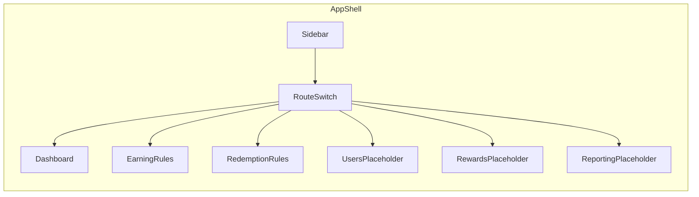
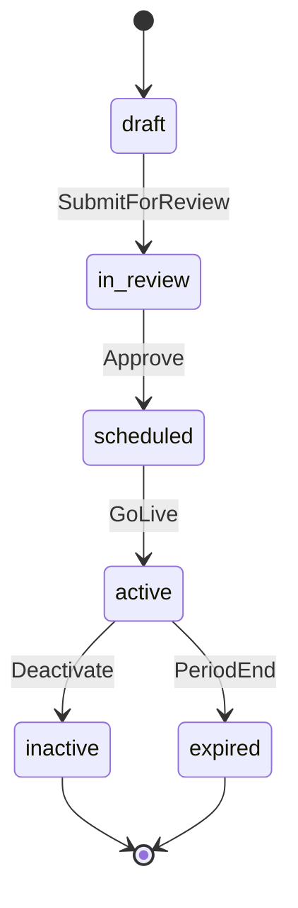

# BNI Loyalty — Back Office Portal

Feature reference for the `banking-loyalty-back-office` prototype. Use this document to track module scope, user flows, data shapes, and implementation status as the app evolves.

## Overview

**Purpose:** Front-end prototype for a banking loyalty program back-office portal. Targets operations, product, finance, and approval teams who manage loyalty points (earning/redemption rules), monitor KPIs, and eventually run reports.

**Branding:** BNI Loyalty — Back Office Portal

**Stack:**

| Layer | Technology |
|-------|------------|
| Framework | React 19 |
| Language | TypeScript 5.8 (strict) |
| Build | Vite 7 |
| Styling | Tailwind CSS 3.4 + custom design tokens |
| Charts | Recharts 2.15 |
| Icons | Lucide React |

**Prototype constraints:**

- Mock data only — no backend, API, or persistence
- No authentication — role toggle is UI-only
- No URL routing — navigation via `useState<RouteKey>` in `src/App.tsx`
- All pages live in a single `App.tsx` file; types in `src/types.ts`, data in `src/data/mockData.ts`

---

## Navigation Map

| Route Key | Label | Description | Status |
|-----------|-------|-------------|--------|
| `dashboard` | Analytics Dashboard | Monitoring KPI loyalty, campaign, liability, dan channel | **Implemented** |
| `earning-rules` | Earning Rule | Konfigurasi aturan perolehan poin | **Implemented** |
| `redemption-rules` | Redemption Rule | Konfigurasi aturan penukaran poin | **Implemented** |
| `users` | User | Daftar dan profil pengguna loyalty | Placeholder |
| `rewards` | Rewards Points Management | Katalog reward dan stok | Placeholder |
| `reporting` | Reporting | Laporan operasional dan rekonsiliasi | Placeholder (tabs only) |

**Shell layout:**



**Header breadcrumb:** `Portal / {activeItem.label}`

**Source files:** `src/types.ts` (`RouteKey`), `src/data/mockData.ts` (`navItems`), `src/App.tsx` (routing)

---

## 1. Analytics Dashboard

**Route:** `dashboard`

### Purpose

Monitor loyalty KPIs across customer engagement, point performance, transaction impact, channel performance, and campaigns. Surfaces open business-definition gaps via an audit panel.

### Key UI Elements

**Filters** (`DashboardFilters`):

| Filter | Options | Notes |
|--------|---------|-------|
| Start / End date | Date inputs | Default from `defaultFilters` in mockData |
| Channel | All, Wondr, ATM, API, BNI Direct, Mbank, SMS | |
| Source system | All, Saving, Cardlink | |
| Transaction type | Purchase, Payment, transfers, VA | **Disabled** unless source = Saving |
| Campaign | Campaign selector | Used in before/after chart |

**KPI card groups** (from `dashboardData`):

1. **Customer Engagement** — CIF Earning MTD, CIF Redeem MTD, Redemption Rate by CIF, Redemption Rate by Poin
2. **Poin Performance** — Total Poin Issued/Redeemed YTD, Poin Balance Liability, Expired Points YTD, Estimated Point Cost (placeholder)
3. **Transaction Impact** — Top Aktivitas, Top Source
4. **Channel Performance** — Top Redeem Channel, Top Earn Channel, Top Reward
5. **Campaign** — Campaign Aktif, Participation Rate, Top Campaign

Each KPI card shows value, detail, delta, and trend (`up` | `down` | `flat`). "View details" links are present but non-functional.

**Charts:**

| Chart | Type | Data source |
|-------|------|-------------|
| Daily / Weekly / Monthly trend | Line | `trends` — CIF earn/redeem, point earn/redeem (millions) |
| Earning poin per aktivitas | Bar | `earningByActivity` |
| Earning poin per source | Donut | `earningBySource` (Saving vs Cardlink) |
| Redemption per channel | Area | `redemptionByChannel` |
| Redemption per reward | Donut | `redemptionByReward` |
| Before vs after campaign | Bar | Derived from selected `CampaignSummary` |

**Other UI:**

- Export PDF / Export PNG buttons (non-functional)
- Dashboard audit panel — 8 business sign-off notes (see [Open Items](#open-items--business-sign-off))
- "Last updated: just now" — no real-time polling

### User Flow

1. App loads with `dashboard` as default route
2. User reviews KPI cards and charts
3. User adjusts filters (dates, channel, source, transaction type)
4. If source ≠ Saving, transaction type resets to "all" and the field disables
5. Trend line chart scales by `filterFactor`; other KPIs and charts remain static
6. User selects a campaign in the before/after comparison chart
7. User scrolls to audit panel to review open business questions
8. Optional: Export PDF/PNG or "View details" (no action)

### State & Data

| State | Type | Location |
|-------|------|----------|
| `filters` | `DashboardFilters` | `Dashboard` component |

**Filter simulation:** Only the trend chart responds to filters via a multiplier:

```
filterFactor = channelFactor × sourceFactor × transactionFactor
```

KPI cards and distribution charts always show full mock data.

### Status

| Capability | Status |
|------------|--------|
| KPI cards | Done (mock) |
| Charts | Done (mock) |
| Filters | Partial — trend only |
| Export | Non-functional |
| Drill-down | Non-functional |
| Real-time SLA | Undefined |

---

## 2. Earning Rule Management

**Route:** `earning-rules`

### Purpose

Configure and review point-earning rules. Supports role-based editing and a full add/edit drawer with conditional fields per rule type.

### Key UI Elements

- **Role toggle:** `employee` | `approver` (UI-only, no auth)
- **Summary counters:** Total rules + count per status (draft, in_review, scheduled, active, inactive, expired)
- **Search:** By rule name, code, or ID
- **Status filter:** All or specific `RuleStatus`
- **Data table columns:** No, Rule (name + code), Period, Type, Status, Created time, Total CIF, Total point, Actions
- **Actions:** Edit (role/status gated), Inactive (active rules only; non-functional)
- **Add rule drawer:** Side panel with conditional fields
- **Export:** CSV / XLSX buttons (non-functional)

**Mock data:** 6 earning rules in `earningRules` covering all rule types and statuses.

### User Flows

#### Employee flow

1. Sidebar → **Earning Rule**
2. Role defaults to **employee**
3. View summary counters and rule table
4. Search and/or filter by status
5. **Edit** visible only on **draft** rules
6. Click **Add rule** → drawer opens with default type `transactional`
7. Select rule type → conditional fields appear
8. Review point calculation example
9. **Submit for review** or **Cancel** (no persistence)

#### Approver flow

1. Toggle role to **approver**
2. **Edit** available for `in_review` and `scheduled` rules
3. Same search, filter, and add flow as employee

### Permissions

```typescript
// src/App.tsx — canEdit()
employee  → edit draft only
approver  → edit in_review, scheduled
```

### State & Data

| State | Type | Purpose |
|-------|------|---------|
| `role` | `Role` | Edit permissions |
| `query` | `string` | Search filter |
| `status` | `RuleStatus \| "all"` | Status filter |
| `drawerOpen` | `boolean` | Drawer visibility |
| `drawerMode` | `"add" \| "edit"` | Drawer mode |
| `drawerRule` | `EarningRule \| null` | Rule being edited |
| `selectedType` | `RuleType` | Active rule type in drawer |

**Data:** `earningRules` from `src/data/mockData.ts`, type `EarningRule` from `src/types.ts`

### Status

| Capability | Status |
|------------|--------|
| List / search / filter | Done |
| Role-gated edit | Done (UI) |
| Add/edit drawer | Done (UI) |
| Submit / Save | Non-functional |
| Inactive | Non-functional |
| Export | Non-functional |

---

## 3. Redemption Rule Management

**Route:** `redemption-rules`

### Purpose

Configure and review point-redemption rules. Same UX as earning rules with redemption-specific fields.

### Key UI Elements

Same as Earning Rule Management, plus:

- **Extra table column:** Cap type (`capType` on `RedemptionRule`)
- **Drawer fields:** Cap type, value point percentage, value min, value max

**Cap types** (`RedemptionRule.capType`):

`cashback`, `discount`, `bill_payment`, `donasi`, `point_pihak_ketiga`, `kupon_undian`, `voucher`, `e_wallet`, `lelang`, `barang`, `annual_fee`

**Mock data:** 5 redemption rules in `redemptionRules`.

### User Flow

Same as earning rules (employee and approver flows). Redemption-specific drawer fields appear when `kind === "redemption"`.

### Permissions

Identical to earning rules (`canEdit` function).

### State & Data

Same state shape as `RuleModule` with `kind: "redemption"`. Data from `redemptionRules`, type `RedemptionRule`.

### Status

Same as earning rules.

---

## 4. Rule Drawer (Shared)

Used by both Earning and Redemption rule modules.

### Purpose

Side panel for creating or editing rules. Fields change based on selected `RuleType`.

### Base Fields (all types)

- Rule name, Rule code
- Period start, Period end
- Rule type selector

### Redemption-only Fields

- Cap type, Value point percentage, Value min, Value max

### Conditional Fields by Rule Type

| Rule Type | Key Fields |
|-----------|------------|
| `activity` | Activity type, Amount field, Receive point / Redeem point |
| `third_party_points` | Card type, Thirdparty (e.g. Garuda), Operator type, Transaction amount, Miles point |
| `personal_earning` | Type (birthday), Target user (CSV upload), Reward type, Receive point |
| `transactional` | Source system, Transaction type, Merchant category/name, Card type, Channel, Transaction amount, Conversion unit, Multiplier, Max capacity, Type/timeframe max capacity |
| `tactical` | Campaign/event name, Target user, Reward type + all transactional fields |

### Point Calculation

Example shown in drawer using `calculatePoints()` from `src/utils/points.ts`:

```
Earned/Redeem Points = floor((transactionAmount / conversionUnit) × multiplier)
Example: (500,000 / 100,000) × 10 = 50 poin
```

### Drawer Actions

| Action | Add mode | Edit mode | Persistence |
|--------|----------|-----------|-------------|
| Cancel | Closes drawer | Closes drawer | — |
| Submit for review / Save changes | Shown | Shown | Non-functional |

---

## 5. User Management (Placeholder)

**Route:** `users`

### Purpose

Future module for user list and loyalty profiles.

### Current State

Navigation slot only. Shows "Ready for next detail pass" placeholder.

### Planned Scope

- User list with search/filter
- Loyalty profile detail view
- Role/permission assignment (TBD)

---

## 6. Rewards Points Management (Placeholder)

**Route:** `rewards`

### Purpose

Future module for reward catalog and stock management.

### Current State

Navigation slot only. Shows "Ready for next detail pass" placeholder.

### Planned Scope

- Reward catalog (voucher, barang, e-wallet, etc.)
- Stock and availability tracking
- Linkage to redemption rules

---

## 7. Reporting (Placeholder)

**Route:** `reporting`

### Purpose

Centralized reporting for earning, redemption, manual operations, pembukuan, and reconciliation.

### Current State

Tab bar UI with 6 report types. Content area is a dashed placeholder. Only tab switching works.

### Report Tabs

| Tab | Description |
|-----|-------------|
| Earning Poin | Earning point reports |
| Redemption Poin | Redemption point reports |
| Manual Adjustment | Manual point adjustments |
| Manual Redemption | Manual redemption operations |
| Hasil pemrosesan pembukuan | Bookkeeping processing results |
| Hasil rekonsiliasi sistem | System reconciliation results |

### Planned Scope

Per-tab: report table, filters, export actions, reconciliation status.

---

## Cross-Cutting Flows

### Mobile Navigation

1. On small screens, sidebar is hidden by default
2. Tap hamburger menu → sidebar slides in with overlay
3. Tap nav item or overlay → sidebar closes, route changes

### Rule Lifecycle



| Status | Label | Meaning |
|--------|-------|---------|
| `draft` | Draft | Rule being authored |
| `in_review` | In Review | Submitted, awaiting approver |
| `scheduled` | Scheduled | Approved, pending go-live |
| `active` | Active | Live rule |
| `inactive` | Inactive | Deactivated by operator |
| `expired` | Expired | Past period end |

---

## Data Model Reference

Source: `src/types.ts`

### Navigation

```typescript
type RouteKey = "dashboard" | "users" | "earning-rules" | "redemption-rules" | "rewards" | "reporting"
type NavItem = { key: RouteKey; label: string; description: string; icon: LucideIcon }
```

### Dashboard

```typescript
type DashboardFilters = {
  startDate: string; endDate: string;
  channel: Channel; sourceSystem: SourceSystem;
  transactionType: TransactionType; campaignId: string;
}

type KpiCard = { label: string; value: string; detail: string; delta: string; trend: "up" | "down" | "flat" }
type TrendPoint = { period: string; cifEarn: number; cifRedeem: number; pointEarn: number; pointRedeem: number }
type DistributionPoint = { name: string; value: number }
type CampaignSummary = { id: string; name: string; active: boolean; targetUsers: number; participants: number; beforeRedeem: number; afterRedeem: number }

type DashboardData = {
  customerEngagement: KpiCard[]; pointPerformance: KpiCard[];
  transactionImpact: KpiCard[]; channelPerformance: KpiCard[]; campaignCards: KpiCard[];
  trends: TrendPoint[]; earningByActivity: DistributionPoint[];
  earningBySource: DistributionPoint[]; redemptionByChannel: DistributionPoint[];
  redemptionByReward: DistributionPoint[]; campaigns: CampaignSummary[];
}
```

### Rules

```typescript
type RuleStatus = "draft" | "in_review" | "scheduled" | "active" | "inactive" | "expired"
type Role = "employee" | "approver"
type RuleType = "transactional" | "activity" | "tactical" | "personal_earning" | "third_party_points"

type RuleBase = {
  id: string; code: string; name: string;
  periodStart: string; periodEnd: string;
  type: RuleType; status: RuleStatus; createdAt: string;
  totalCif: number; totalPoints: number;
  sourceSystem?: "saving" | "cardlink";
  transactionType?: Exclude<TransactionType, "all">;
  channel?: Exclude<Channel, "all">;
}

type EarningRule = RuleBase & {
  conversionUnit?: number; multiplier?: number; maxCapacity?: number;
  activityType?: string; rewardType?: "bonus_point" | "transactional";
}

type RedemptionRule = RuleBase & {
  capType: "cashback" | "discount" | "bill_payment" | "donasi" | "point_pihak_ketiga"
    | "kupon_undian" | "voucher" | "e_wallet" | "lelang" | "barang" | "annual_fee";
  valuePointPercentage: number; valueMin: number; valueMax: number;
  ruleTabId: string; sourceTypeId: string; updatedAt: string;
}
```

### Enums

```typescript
type SourceSystem = "all" | "saving" | "cardlink"
type Channel = "all" | "wondr" | "atm" | "api" | "bni-direct" | "mbank" | "sms"
type TransactionType = "all" | "purchase" | "payment" | "ingoing-transfer" | "outgoing-transfer" | "va"
```

### Utilities (`src/utils/points.ts`)

| Function | Purpose |
|----------|---------|
| `calculatePoints(amount, unit, multiplier)` | `floor((amount / unit) × multiplier)` |
| `formatCompact(value)` | en locale compact notation |
| `formatNumber(value)` | id-ID locale formatting |

---

## Open Items / Business Sign-Off

From `auditNotes` in `src/data/mockData.ts`. These items need stakeholder resolution before backend integration.

1. **Metric formulas** — Redemption rate by point vs by CIF, point balance liability, expired points, participation rate, growth, and campaign comparison need sign-off.
2. **Estimated Point Cost** — Cost is mentioned in requirements but no KPI definition exists; currently a placeholder.
3. **Real-time SLA** — Undefined; prototype shows "Last updated: just now" without polling.
4. **Filter sources** — Filter options are mocked. Transaction type only enabled when source = Saving.
5. **Drill-down targets** — Not specified; "View details" actions are intentionally non-functional.
6. **Reconciliation workflow** — Referenced operationally but remains in Reporting until workflow ownership is defined.
7. **Campaign comparison** — Requires selected campaign and baseline period; prototype uses mock campaign periods.
8. **Finance governance** — Liability and expired points are read-only; likely need audit trails.

---

## Implementation Matrix

| Area | UI | Data | Persistence | Notes |
|------|----|------|-------------|-------|
| Dashboard | Done | Mock | None | Filters partially simulated |
| Earning rules | Done | Mock | None | Role-gated edit |
| Redemption rules | Done | Mock | None | Same as earning |
| Users | Shell | — | — | Next detail pass |
| Rewards | Shell | — | — | Next detail pass |
| Reporting | Tabs only | — | — | Next detail pass |
| Auth | — | — | — | Role toggle is UI-only |
| URL routing | — | — | — | State-based only |
| Tests | — | — | — | None |

---

## Maintenance

Update this file when:

- New routes or modules are added to navigation
- Placeholder modules (Users, Rewards, Reporting) are implemented
- Business rules are signed off — move resolved items out of [Open Items](#open-items--business-sign-off)
- Backend integration changes flows, state, or data models
- Non-functional actions become wired up (export, drill-down, CRUD persistence)

**Key source files:**

| File | Role |
|------|------|
| `src/App.tsx` | Shell, routing, all pages and UI |
| `src/types.ts` | Domain type definitions |
| `src/data/mockData.ts` | Static data, nav config, audit notes |
| `src/utils/points.ts` | Point math and formatting |
